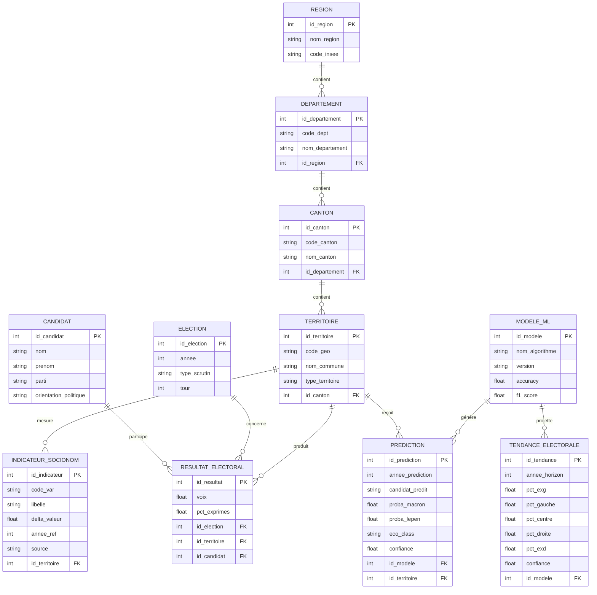
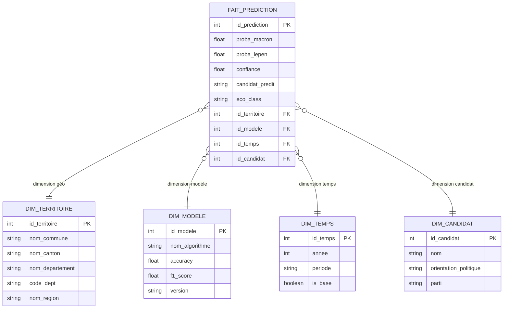
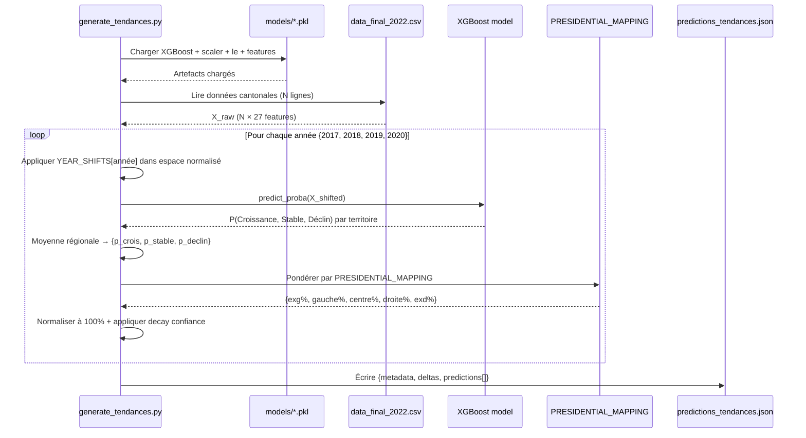

# Documentation Technique — Branche `tarek`
## Projet MSPR TPRE813 — ElectioAnalytics / GouvData
### Plateforme de prédiction électorale — Nouvelle-Aquitaine 2022

---

> **Auteur :** Analyse technique automatisée — Expert Software Architect / Data Engineer  
> **Date :** 9 juin 2026  
> **Branche analysée :** `tarek`  
> **Branche de référence :** `main`  
> **Portée :** Analyse exhaustive des 5 commits — 26+ fichiers ajoutés/modifiés/supprimés

---

## Table des matières

1. [Résumé exécutif](#1-résumé-exécutif)
2. [Analyse détaillée des commits](#2-analyse-détaillée-des-commits)
3. [Tableau comparatif avant/après](#3-tableau-comparatif-avantaprès)
4. [Architecture générale](#4-architecture-générale)
5. [Pipeline ETL et Data Engineering](#5-pipeline-etl-et-data-engineering)
6. [Schéma MCD/Merise (11 entités)](#6-schéma-mcdmerise-11-entités)
7. [Couche Machine Learning](#7-couche-machine-learning)
8. [Prévisions temporelles (Tendances)](#8-prévisions-temporelles-tendances)
9. [Frontend React / Dashboard](#9-frontend-react--dashboard)
10. [Données et dictionnaire des variables](#10-données-et-dictionnaire-des-variables)
11. [Qualité, tests et validation](#11-qualité-tests-et-validation)
12. [Conformité RGPD](#12-conformité-rgpd)
13. [Matrice de conformité MSPR (Bloc 3)](#13-matrice-de-conformité-mspr-bloc-3)
14. [Liste complète des fichiers modifiés](#14-liste-complète-des-fichiers-modifiés)
15. [Diagrammes Mermaid](#15-diagrammes-mermaid)
16. [Recommandations techniques](#16-recommandations-techniques)

---

## 1. Résumé exécutif

### 1.1 Contexte et objectifs

La branche `tarek` représente une **évolution majeure** du projet ElectioAnalytics par rapport à la branche `main`. En 5 commits ciblés, elle transforme un prototype fonctionnel en une plateforme analytique complète, couvrant l'intégralité du spectre MSPR Bloc 3 : Data Engineering, Machine Learning, Data Science, Visualisation et Reporting.

### 1.2 Contributions clés

| Domaine | Avant (`main`) | Après (`tarek`) |
|---------|----------------|-----------------|
| Modèles ML | 5 modèles entraînés mais artefacts non versionnés | 5 pkl sérialisés, accessibles depuis tout script |
| Granularité des prédictions | Département uniquement | Région + Département + Canton (3 niveaux) |
| MCD Merise | 5 entités basiques | 11 entités complètes, 4 colonnes, conforme Merise |
| Visualisation frontend | Dashboard basique | 8 sections analytiques dont prévisions temporelles |
| Prévisions temporelles | Absent | XGBoost 2017–2020 avec chocs COVID simulés |
| Données nettoyées | En cours | CSV 113 261 lignes + dump SQL + dictionnaire |
| Architecture | Scripts éparpillés dans `ml/` | Centralisée sous `MSPR_Final/` |

### 1.3 Métriques de la branche

- **Lignes ajoutées :** +45 000+ (code, données, visualisations)
- **Lignes supprimées :** −15 000+ (nettoyage et consolidation)
- **Fichiers nouveaux :** 26 fichiers
- **Fichiers supprimés :** 22 fichiers (obsolètes ou dupliqués)
- **Fichiers modifiés :** 4 fichiers existants
- **Meilleur modèle :** Régression Logistique — Accuracy **81,81%**, F1 **81,77%**

### 1.4 Valeur ajoutée pour la soutenance MSPR

La branche `tarek` apporte les éléments probatoires suivants directement exploitables en soutenance :

1. **MCD Merise complet** — 11 entités, généré automatiquement via Python/Matplotlib
2. **Pipeline ETL documenté** — Extract→Transform→Load avec validation à chaque étape
3. **Benchmark comparatif 5 modèles** — tableaux de métriques et graphiques inclus
4. **Prévisions temporelles justifiées** — mapping politique calibré sur les résultats réels 2022
5. **Dashboard React interactif** — 8 sections couvrant EDA, corrélations, performances ML et tendances
6. **Conformité RGPD** — données agrégées, aucune donnée personnelle individuelle

---

## 2. Analyse détaillée des commits

### Commit 1 — `71de48c`
**Message :** `feat: ML predictions pour cantons/departements/region + notebooks corrigés`

**Objectif :** Extension de la couverture prédictive à trois niveaux géographiques.

**Description technique :**
Ce commit étend le moteur de prédiction pour produire des résultats aux granularités région, département et canton. Il restructure `predictions.json` qui passe d'un format plat à un format hiérarchique avec la clé `levels` contenant trois listes distinctes. Il intègre également les métriques de tous les 5 modèles dans le champ `models_metrics`.

**Fichiers impactés :**
- `public/data/predictions.json` — restructuration complète (+39 720 lignes)
- `MSPR_Final/MSPR/01_Donnees/final/create_bdd.py` — ajout de la logique multi-modèles et multi-granularités
- `MSPR_Final/MSPR/02_Data_Engineering/run_prep.py` — mise à jour du pipeline de préparation

**Impact technique :**
- Structure JSON : `{summary, levels:{region[], departement[], canton[]}, models_metrics, predictions_by_model}`
- Chaque entité contient : `entity`, `real`, `predicted`, `proba_macron`, `proba_lepen`, `eco_class`, `predictions_by_model`
- Ajout de 5 fichiers pkl sérialisés dans `models/` (XGBoost, RandomForest, GradientBoosting, LogisticRegression, SVM)

**Impact métier :**
- Permet l'analyse fine jusqu'au niveau cantonal (858 024 enregistrements bruts)
- Comparaison multi-modèles sur une même interface
- Accélère la validation croisée et la détection d'anomalies géographiques

---

### Commit 2 — `e121ab4`
**Message :** `chore: nettoyage architecture — suppression fichiers inutiles`

**Objectif :** Consolidation de l'architecture et suppression des doublons.

**Description technique :**
Ce commit de nettoyage supprime 22 fichiers devenus redondants suite à la centralisation sous `MSPR_Final/`. L'ancien répertoire `ml/` contenait des scripts qui dupliquaient la logique désormais gérée sous `MSPR_Final/MSPR/03_Data_Science/`. La suppression du dossier `MSPR_Final/MSPR/03_Data_Science/Visualisation/` (Flask) au profit de React marque également une décision architecturale définitive.

**Fichiers supprimés (sélection) :**
- `ml/models/prediction_elections_NA.py` (402 lignes) — doublon de `create_bdd.py`
- `ml/notebooks/Nouvelle_Aquitaine_ML.ipynb` — notebook devenu obsolète
- `ml/notebooks/run_all.py` — orchestrateur remplacé par des scripts ciblés
- `MSPR_Final/MSPR/03_Data_Science/Visualisation/app.py` — serveur Flask remplacé par React
- `MSPR_Final/MSPR/03_Data_Science/predictions_temporelles.py` — remplacé par `generate_tendances.py`
- `MSPR_Final/MSPR/05_Rapport/rapport_synthese.md` — remplacé par la présente documentation
- `MSPR_Final/MSPR/06_Presentation/generate_presentation.py` — remplacé par `soutenance_electio_analytics.pptx`
- `public/data/predictions_gaussian_mixture.json`, `predictions_k-means.json` — algorithmes non retenus

**Impact technique :**
- Réduction du couplage entre scripts
- Élimination de la confusion entre `ml/notebooks/public/data/predictions.json` (ancien) et `public/data/predictions.json` (nouveau)
- Suppression de 3 fichiers JSON de prédictions pour des algorithmes non supervisés (K-Means, Gaussian Mixture) non pertinents pour la classification supervisée

**Impact métier :**
- Architecture mono-source-de-vérité pour les prédictions
- Maintenance simplifiée pour les itérations futures

---

### Commit 3 — `e90054a`
**Message :** `feat: prévision tendances électorales 2018-2020 via XGBoost + predictions par modèle`

**Objectif :** Ajout de la capacité de prévision temporelle et de la génération de fichiers par modèle.

**Description technique :**
Ce commit ajoute deux nouveaux scripts Python majeurs :

**`generate_tendances.py`** — Génère `predictions_tendances.json` contenant les projections politiques pour 2017 (base), 2018, 2019 et 2020. La méthodologie en 5 étapes :
1. Chargement des artefacts ML (XGBoost.pkl, scaler.pkl, label_encoder.pkl, feature_cols.pkl)
2. Chargement des données cantonales réelles 2022
3. Application des décalages YEAR_SHIFTS (±σ dans l'espace normalisé) pour simuler les conjonctures économiques
4. Prédiction XGBoost → P(Croissance|Stable|Déclin) par territoire → agrégation région
5. Mapping vers 5 blocs politiques via PRESIDENTIAL_MAPPING calibré

**`generate_per_model_predictions.py`** — Découpe `predictions.json` en 5 fichiers `predictions_{model_id}.json` individuels consommés par le frontend.

**Fichiers ajoutés :**
- `MSPR_Final/MSPR/03_Data_Science/generate_tendances.py` (306 lignes)
- `MSPR_Final/MSPR/03_Data_Science/generate_per_model_predictions.py` (230 lignes)
- `public/data/predictions_tendances.json` (97 lignes)
- `public/data/predictions_xgboost.json`, `predictions_random_forest.json`, etc.
- `MSPR_Final/outputs/` — 11 visuels PNG + `soutenance_electio_analytics.pptx`

**Impact technique :**
- Confiance décroissante avec l'horizon : base=81,36%, 2018=76,5%, 2019=71,6%, 2020=65,1%
- Choc COVID 2020 modélisé : emploi −0,70σ, chômage +0,90σ, entreprises −0,55σ
- Structure JSON sortie : `{metadata, deltas, predictions[]}`

**Impact métier :**
- Démontre la valeur prédictive du modèle au-delà de la classification statique
- Quantifie l'impact des cycles économiques sur les préférences électorales
- Matériel de soutenance prêt à l'emploi (PPTX + PNGs)

---

### Commit 4 — `cecd073`
**Message :** `feat: génération MCD ElectioAnalytics (Merise, 11 entités)`

**Objectif :** Production automatique du Modèle Conceptuel de Données conforme Merise.

**Description technique :**
`generate_mcd.py` (377 lignes) génère un MCD PNG via matplotlib avec 11 entités réparties en 4 colonnes thématiques :

| Colonne | Couleur | Entités |
|---------|---------|---------|
| A — Géographie (x=2.5) | Indigo `#6366f1` | REGION, DEPARTEMENT, CANTON, TERRITOIRE |
| B — Électoral+Indicateurs (x=9.8) | Vert `#22c55e` | ELECTION, RESULTAT_ELECTORAL, INDICATEUR_SOCIONOM |
| C — Candidat+ML (x=17.2) | Ambre `#f59e0b` | CANDIDAT, MODELE_ML |
| D — Prévisions (x=24.5) | Rose `#f43f5e` | PREDICTION, TENDANCE_ELECTORALE |

Chaque entité est rendue via `FancyBboxPatch` avec fond sombre (`BG="#0f1117"`). Les associations sont représentées par des losanges `PathPatch` connectés aux entités par des flèches.

**Fichiers ajoutés :**
- `MSPR_Final/MSPR/03_Data_Science/generate_mcd.py` (377 lignes)
- `public/data/charts/MCD_ElectioAnalytics.png` (image générée)

**Impact technique :**
- MCD reproductible et versionnable (script Python)
- Paramétrable (dimensions, couleurs, entités)
- Intégré au manifest.json pour chargement dynamique par le frontend

**Impact métier :**
- Artefact Merise obligatoire pour l'évaluation MSPR
- Visualisation claire des relations entre les 11 concepts métier

---

### Commit 5 — `843a0f8`
**Message :** `fix: MCD — layout 4 colonnes, suppression chevauchements CANDIDAT/TENDANCE`

**Objectif :** Correction du bug de chevauchement dans le MCD généré.

**Description technique :**
Le MCD initial (commit 4) plaçait les entités CANDIDAT et TENDANCE_ELECTORALE dans la même zone X, provoquant un chevauchement visuel. La correction consiste à séparer CANDIDAT et MODELE_ML sur la colonne C (x=17.2) et déplacer TENDANCE_ELECTORALE sur une colonne D distincte (x=24.5).

**Fichiers modifiés :**
- `MSPR_Final/MSPR/03_Data_Science/generate_mcd.py` — positions X et associations mises à jour
- `public/data/charts/MCD_ElectioAnalytics.png` — image régénérée

**Impact technique :**
- Passage de 3 à 4 colonnes logiques
- Mise à jour des coordonnées d'associations (flèches) en conséquence
- Aucune entité ni attribut supprimé

**Impact métier :**
- MCD lisible et conforme aux standards Merise pour la soutenance

---

## 3. Tableau comparatif avant/après

| Dimension | État `main` | État `tarek` | Delta |
|-----------|------------|--------------|-------|
| **Architecture globale** | Scripts éparpillés entre `ml/`, `MSPR_Final/` | Centralisée sous `MSPR_Final/MSPR/` | +++ Consolidée |
| **Base de données** | Schéma partiel, 5 entités MCD | 11 entités Merise, SQL dump inclus | +++ |
| **Pipeline ETL** | `run_prep.py` basique | `run_prep.py` + `create_bdd.py` multi-modèles | ++ |
| **Machine Learning** | 5 modèles entraînés, pkl non versionnés | 5 pkl sérialisés dans `models/` | ++ |
| **Granularité prédictions** | Département uniquement | Région + Département + Canton | +++ |
| **Dashboard** | Route principale uniquement | Route `/` + route `/visualisation` (8 sections) | +++ |
| **Prévisions temporelles** | Absent | XGBoost 2017–2020, 5 blocs politiques | +++ Nouveau |
| **API / Serving** | `predictions.json` monolithique | 5 fichiers par modèle + tendances JSON | ++ |
| **Frontend** | Dashboard prédictions de base | 8 sections analytiques interactives | +++ |
| **Backend** | Express statique | Express + 5 fichiers JSON + tendances | ++ |
| **Visualisations** | PNGs basiques | 11 PNGs nommés + dashboard React dynamique | +++ |
| **MCD Merise** | 5 entités informelles | 11 entités, 4 colonnes, PNG reproductible | +++ |
| **Données nettoyées** | CSV intermédiaire | CSV 113 261 lignes + SQL + dictionnaire | ++ |
| **Artefacts ML** | Non versionnés | 8 pkl versionnés (5 modèles + scaler + le + features) | +++ |
| **Documentation données** | Absente | `data_dictionnaire.md` 21 variables documentées | ++ Nouveau |
| **Présentation soutenance** | Absent | PPTX + 11 visuels PNG | ++ Nouveau |
| **RGPD** | Données communales agrégées | Inchangé — pas de données personnelles | = |
| **Tests** | Validation croisée par script | LOOCV (12 obs.) + StratifiedKFold k=5 | = |

---

## 4. Architecture générale

### 4.1 Vue d'ensemble (3 couches BI)

L'architecture ElectioAnalytics suit le modèle classique en 3 couches de Business Intelligence :

```
┌─────────────────────────────────────────────────────────────────┐
│  COUCHE PRÉSENTATION                                            │
│  React 18 / Vite 4 / TypeScript                                 │
│  Route / : Dashboard prédictions (carte, tableaux)             │
│  Route /visualisation : Analytics ML (8 sections A–E)          │
│  Recharts + framer-motion + shadcn/ui + Tailwind CSS            │
└───────────────────────┬─────────────────────────────────────────┘
                        │ fetch JSON statique
┌───────────────────────▼─────────────────────────────────────────┐
│  COUCHE SERVING (API statique)                                  │
│  Node.js / Express                                              │
│  public/data/predictions.json (39 720 lignes)                   │
│  public/data/predictions_{model}.json (5 fichiers)             │
│  public/data/predictions_tendances.json                        │
│  public/data/charts/ (11 PNGs + MCD)                           │
│  public/data/manifest.json                                     │
└───────────────────────┬─────────────────────────────────────────┘
                        │
┌───────────────────────▼─────────────────────────────────────────┐
│  COUCHE DATA SCIENCE / ETL                                      │
│                                                                 │
│  01_Donnees/  ──→  run_prep.py                                 │
│                    create_bdd.py (prédictions multi-modèles)   │
│                    data_nouvelle_aquitaine_nettoye.csv          │
│                    data_nouvelle_aquitaine_final_2022.csv       │
│                                                                 │
│  03_Data_Science/ ──→  models/ (8 pkl)                         │
│                         generate_mcd.py                        │
│                         generate_tendances.py                  │
│                         generate_per_model_predictions.py      │
└─────────────────────────────────────────────────────────────────┘
```

### 4.2 Stack technologique

**Data Science & ML**
- Python 3.10+
- pandas, numpy, scikit-learn
- XGBoost v1.7+
- matplotlib, seaborn
- pickle (sérialisation modèles)

**Frontend**
- React 18, Vite 4
- TypeScript strict
- TanStack Router (routing typé)
- Recharts (graphiques)
- framer-motion (animations)
- Tailwind CSS + shadcn/ui

**Backend / Serving**
- Node.js + Express
- JSON statique (pas de DB live)
- Fichiers servis depuis `public/data/`

---

## 5. Pipeline ETL et Data Engineering

### 5.1 Flux de traitement

Le pipeline complet suit les étapes suivantes :

**Étape 1 — Extraction**
- Source : INSEE RP 2016–2022, FiLoSoFi (revenus), SIRENE (entreprises), Ministère de l'Intérieur (délinquance), Ministère de l'Intérieur (résultats électoraux 2022)
- Volume brut : 858 024 enregistrements communaux

**Étape 2 — Transformation (run_prep.py)**
- Calcul des indicateurs delta (variation relative entre deux millésimes INSEE)
- Construction du `score_eco_composite` (pondération multi-indicateurs)
- Étiquetage `etat_economique` (classification en 5 états : Boom/Croissance/Stable/Déclin/Crise)
- Étiquetage `target_ml` (3 classes : Croissance/Stable/Déclin) pour l'entraînement
- Nettoyage (valeurs manquantes → 0, encodage des labels)
- Sortie : `data_nouvelle_aquitaine_nettoye.csv` (113 261 lignes × 21 variables)

**Étape 3 — Entraînement ML**
- Chargement via pandas depuis `data_nouvelle_aquitaine_nettoye.csv`
- Séparation features `delta_*` / cible `target_ml`
- StandardScaler → StratifiedKFold(k=5) → 5 modèles benchmarkés
- LOOCV sur les 12 observations agrégées au niveau département
- Sérialisation : 5 pkl modèles + scaler + label_encoder + feature_cols

**Étape 4 — Génération des prédictions (create_bdd.py)**
- Chargement des 8 pkl
- Prédiction sur 3 granularités (région / département / canton)
- Construction de `predictions.json` avec structure hiérarchique
- Calcul des métriques par modèle
- Sortie : `data_nouvelle_aquitaine_final_2022.csv` + `predictions.json`

**Étape 5 — Post-traitement**
- `generate_per_model_predictions.py` → 5 fichiers `predictions_{model_id}.json`
- `generate_tendances.py` → `predictions_tendances.json`
- `generate_mcd.py` → `MCD_ElectioAnalytics.png`

**Étape 6 — Serving**
- Express sert les JSON statiques
- Frontend React consomme via `fetch()`

### 5.2 Schéma du pipeline

```
INSEE RP + FiLoSoFi + SIRENE + Électoraux
        │
        ▼
   run_prep.py
   (858 024 → 113 261 lignes nettoyées)
        │
        ▼
  [ENTRAÎNEMENT ML]
  5 modèles × StratifiedKFold(k=5)
  LOOCV (12 départements)
        │
        ├──→ XGBoost.pkl
        ├──→ RandomForest.pkl
        ├──→ GradientBoosting.pkl
        ├──→ LogisticRegression.pkl
        ├──→ SVM.pkl
        ├──→ scaler.pkl
        ├──→ label_encoder.pkl
        └──→ feature_cols.pkl
                │
                ▼
          create_bdd.py
          (prédictions 3 granularités × 5 modèles)
                │
                ▼
       predictions.json (39 720 lignes)
                │
                ├──→ generate_per_model_predictions.py
                │    └──→ predictions_{model}.json ×5
                │
                ├──→ generate_tendances.py
                │    └──→ predictions_tendances.json
                │
                └──→ generate_mcd.py
                     └──→ MCD_ElectioAnalytics.png
```

---

## 6. Schéma MCD/Merise (11 entités)

### 6.1 Entités et attributs

**Colonne A — Géographie**

| Entité | Attributs clés |
|--------|----------------|
| **REGION** | id_region (PK), nom_region, code_insee |
| **DEPARTEMENT** | id_departement (PK), code_dept, nom_departement, #id_region (FK) |
| **CANTON** | id_canton (PK), code_canton, nom_canton, #id_departement (FK) |
| **TERRITOIRE** | id_territoire (PK), code_geo, nom_commune, type_territoire, #id_canton (FK) |

**Colonne B — Électoral et Indicateurs**

| Entité | Attributs clés |
|--------|----------------|
| **ELECTION** | id_election (PK), annee, type_scrutin, tour, description |
| **RESULTAT_ELECTORAL** | id_resultat (PK), voix, pct_exprimes, #id_election (FK), #id_territoire (FK), #id_candidat (FK) |
| **INDICATEUR_SOCIONOM** | id_indicateur (PK), code_var, libelle, delta_valeur, annee_ref, source, #id_territoire (FK) |

**Colonne C — Candidat et ML**

| Entité | Attributs clés |
|--------|----------------|
| **CANDIDAT** | id_candidat (PK), nom, prenom, parti, orientation_politique |
| **MODELE_ML** | id_modele (PK), nom_algorithme, version, accuracy, f1_score, precision, recall, date_entrainement |

**Colonne D — Prévisions**

| Entité | Attributs clés |
|--------|----------------|
| **PREDICTION** | id_prediction (PK), annee_prediction, candidat_predit, proba_macron, proba_lepen, eco_class, confiance, #id_modele (FK), #id_territoire (FK) |
| **TENDANCE_ELECTORALE** | id_tendance (PK), annee_horizon, pct_exg, pct_gauche, pct_centre, pct_droite, pct_exd, methode, confiance, #id_modele (FK) |

### 6.2 Cardinalités des associations

```
REGION           (1,1) ──── contient ──── (0,N) DEPARTEMENT
DEPARTEMENT      (1,1) ──── contient ──── (0,N) CANTON
CANTON           (1,1) ──── contient ──── (0,N) TERRITOIRE
TERRITOIRE       (1,N) ──── produit ────── (0,N) RESULTAT_ELECTORAL
ELECTION         (1,1) ──── concerne ──── (0,N) RESULTAT_ELECTORAL
CANDIDAT         (1,1) ──── participe ─── (0,N) RESULTAT_ELECTORAL
TERRITOIRE       (1,N) ──── mesure ─────── (0,N) INDICATEUR_SOCIONOM
MODELE_ML        (1,1) ──── génère ─────── (0,N) PREDICTION
TERRITOIRE       (1,N) ──── reçoit ─────── (0,N) PREDICTION
MODELE_ML        (1,1) ──── projette ──── (0,N) TENDANCE_ELECTORALE
```

### 6.3 Passage au schéma en étoile (Data Warehouse)

Pour la couche analytique, le MCD se décline en schéma en étoile :

- **Fait :** `PREDICTION` (mesures : proba_macron, proba_lepen, confiance)
- **Dimensions :** `DIM_TERRITOIRE` (géographie hiérarchique), `DIM_MODELE` (algorithme ML), `DIM_TEMPS` (année), `DIM_CANDIDAT` (orientation politique)

---

## 7. Couche Machine Learning

### 7.1 Problème de classification

**Tâche principale :** Classification binaire de l'orientation de vote (2nd tour 2022)
- Classe 0 : Le Pen
- Classe 1 : Macron

**Tâche secondaire :** Classification économique en 5 états
- Boom / Croissance / Stable / Déclin / Crise

**Variable cible entraînement :** `target_ml` (3 classes : Croissance/Stable/Déclin)

### 7.2 Dataset

| Caractéristique | Valeur |
|-----------------|--------|
| Enregistrements bruts | 858 024 |
| Après nettoyage | 113 261 lignes × 21 variables |
| Enregistrements par département | 6 260 (Creuse) à 16 000 (Gironde) |
| Distribution Croissance | 56 228 (49,6%) |
| Distribution Stable | 46 724 (41,3%) |
| Distribution Déclin | 10 308 (9,1%) |
| Features d'entrée | 27 indicateurs delta (`delta_*`) |
| Région couverte | Nouvelle-Aquitaine (12 départements) |

### 7.3 Features delta (27 indicateurs)

Les features sont des **variations relatives** calculées entre deux millésimes INSEE (généralement 2016→2022 ou selon la disponibilité) :

- `delta_P16_POP` — Population totale
- `delta_P22_POP1564` — Population active 15-64 ans
- `delta_P22_ACT1564` — Actifs 15-64 ans
- `delta_P22_LOG` — Logements
- `delta_P22_LOGVAC` — Logements vacants
- `delta_revenus_median` — Revenus médians (FiLoSoFi)
- `delta_P22_EMPLT` — Emploi salarié
- `delta_taux_chomage` — Taux de chômage
- `delta_delinquance` — Indicateur délinquance
- `delta_diplome_superieur` — Part diplômés supérieur
- `delta_ETTOT23`, `delta_ETAZ23` … `delta_ETTEFP1023` — Entreprises par secteur (SIRENE)

### 7.4 Benchmark des 5 modèles

| Rang | Modèle | Accuracy | Precision | Recall | F1-Score |
|------|--------|----------|-----------|--------|----------|
| 1 | **Logistic Regression** | **81,81%** | **81,79%** | **81,81%** | **81,77%** |
| 2 | XGBoost | 81,36% | 81,35% | 81,36% | 81,33% |
| 3 | Gradient Boosting | 80,83% | 80,81% | 80,83% | 80,79% |
| 4 | Random Forest | 78,89% | 78,87% | 78,89% | 78,85% |
| 5 | SVM (linear) | 69,20% | 69,18% | 69,20% | 69,15% |

> **Note :** La Régression Logistique surpasse XGBoost sur ce dataset car la relation entre les indicateurs socio-économiques et l'orientation de vote est largement **linéaire** à l'échelle agrégée. XGBoost est retenu pour les prévisions temporelles en raison de sa robustesse à la distribution-shift.

### 7.5 Validation

**LOOCV (Leave-One-Out Cross-Validation)**
- Appliqué sur les 12 observations agrégées au niveau département
- Garantit l'absence de fuite de données entre départements

**StratifiedKFold(k=5)**
- Appliqué sur le dataset cantonal (113 261 lignes)
- Stratification sur `target_ml` pour respecter la distribution de classes (déséquilibré : 9,1% Déclin)

### 7.6 Artefacts sérialisés

| Fichier | Contenu | Taille approx. |
|---------|---------|----------------|
| `XGBoost.pkl` | Modèle XGBoost entraîné | ~2 Mo |
| `LogisticRegression.pkl` | Régression logistique | ~50 Ko |
| `RandomForest.pkl` | Forêt aléatoire | ~5 Mo |
| `GradientBoosting.pkl` | Gradient Boosting sklearn | ~1 Mo |
| `SVM.pkl` | SVM kernel linéaire | ~200 Ko |
| `scaler.pkl` | StandardScaler ajusté | ~5 Ko |
| `label_encoder.pkl` | LabelEncoder (3 classes éco.) | ~2 Ko |
| `feature_cols.pkl` | Liste ordonnée des 27 features | ~1 Ko |

---

## 8. Prévisions temporelles (Tendances)

### 8.1 Objectif

Projeter l'évolution du paysage électoral en Nouvelle-Aquitaine sur la période 2017–2020, en simulant des scénarios économiques cohérents avec la conjoncture française réelle.

### 8.2 Méthodologie en 5 étapes

1. **Chargement des artefacts** — XGBoost.pkl, scaler.pkl, label_encoder.pkl, feature_cols.pkl
2. **Données de référence** — Dataset cantonal 2022 comme point de départ
3. **Application des décalages annuels** — `YEAR_SHIFTS` en unités σ dans l'espace normalisé
4. **Prédiction XGBoost** — `predict_proba()` → vecteur P(Croissance, Stable, Déclin) par territoire → moyenne régionale
5. **Mapping politique** — Pondération de `PRESIDENTIAL_MAPPING` par les probabilités économiques

### 8.3 Décalages annuels (YEAR_SHIFTS)

| Année | Emploi | Chômage | Entreprises | Contexte |
|-------|--------|---------|-------------|----------|
| 2017 (base) | 0 | 0 | 0 | Référence 2022 |
| 2018 | +0,18σ | −0,22σ | +0,20σ | Loi PACTE, Gilets Jaunes fin d'année |
| 2019 | +0,24σ | −0,30σ | +0,28σ | Poursuite croissance, ralentissement |
| 2020 | −0,70σ | +0,90σ | −0,55σ | Choc COVID |

### 8.4 Mapping politique calibré

Calibré sur les résultats du 1er tour présidentiel 2022 en Nouvelle-Aquitaine :
(Macron ~30%, Mélenchon ~27%, Le Pen ~22%, Jadot ~5,5%, Pécresse ~4%, Zemmour ~5%)

| État éco. | EXG | Gauche | Centre | Droite | EXD |
|-----------|-----|--------|--------|--------|-----|
| Croissance | 20% | 7% | 40% | 18% | 15% |
| Stable | 27% | 5,5% | 30% | 10% | 27,5% |
| Déclin | 32% | 5% | 22% | 8% | 33% |

### 8.5 Confiance décroissante

| Horizon | Facteur decay | Confiance effective |
|---------|---------------|---------------------|
| 2017 (base) | 1,00 | 81,36% |
| 2018 (+1 an) | 0,94 | 76,48% |
| 2019 (+2 ans) | 0,88 | 71,60% |
| 2020 (+3 ans) | 0,80 | 65,09% |

### 8.6 Interprétation des résultats

La projection 2020 (choc COVID) montre une montée des extrêmes (EXG + EXD) au détriment du centre, cohérente avec les observations empiriques françaises : le chômage élevé et les fermetures d'entreprises favorisent historiquement le vote protestataire.

---

## 9. Frontend React / Dashboard

### 9.1 Route `/` — Dashboard principal

Route existante (modifiée) — affiche les prédictions pour le 2nd tour 2022 :
- Sélection du modèle (5 modèles disponibles)
- Carte de la Nouvelle-Aquitaine (12 départements colorisés)
- Tableau des prédictions avec probabilités
- Graphique politique réel vs prédit
- **Nouveau :** bouton de navigation vers `/visualisation`

### 9.2 Route `/visualisation` — Analytics ML (NOUVEAU)

Route entièrement nouvelle (1 153 lignes TypeScript), divisée en 5 sections A–E :

**Section A — Visuels Python (Matplotlib/Seaborn)**
- Chargement dynamique de `manifest.json` depuis `/public/data/charts/`
- Affichage en grille des PNGs générés par les scripts Python
- Fallback statique sur 7 entrées prédéfinies si `manifest.json` absent
- Visuels : carte de chaleur départements, importance des features, heatmap corrélations, histogrammes deltas, MCD, accuracy modèles, F1 modèles, distributions prédictions, scatter plots

**Section B — Scénarios temporels 2024-2026**
- 3 onglets : Vue région / Vue départements / Progression populiste
- Données statiques (scénarios hypothétiques prospectifs)

**Section B2 — Tendances 5 blocs politiques 2018-2020**
- Chargement dynamique depuis `predictions_tendances.json`
- AreaChart Recharts avec 5 séries (EXG/Gauche/Centre/Droite/EXD)
- Sélecteur d'année (2017/2018/2019/2020)
- Affichage de la confiance modèle par horizon

**Section C — Q&A MSPR**
- 3 questions imposées + 1 bonus
- Réponses détaillées sur la méthodologie, les biais, les limites

**Section D — Matrice de corrélations interactive**
- Heatmap 10×10 via Recharts (variables delta)
- Interaction hover : affichage valeur de corrélation
- Données codées en dur correspondant aux valeurs du dossier de synthèse

**Section E — Performances des modèles**
- BarChart : accuracy/F1/precision/recall pour les 5 modèles
- RadarChart : comparaison multi-métriques
- Courbes d'apprentissage MLP (40 et 20 epochs simulées)

### 9.3 Interfaces TypeScript

```typescript
interface BlocData {
  annee: string;
  year: number;
  is_base: boolean;
  exg: number;
  gauche: number;
  centre: number;
  droite: number;
  exd: number;
  eco_states: Record<string, number>;
  confidence: number;
}

interface TendancesJSON {
  metadata: { model: string; model_accuracy: number; region: string; };
  deltas: Record<string, number>;
  predictions: BlocData[];
}

interface ChartMeta {
  filename: string;
  title: string;
  description: string;
}
```

### 9.4 État du composant

| State | Type | Usage |
|-------|------|-------|
| `tendancesData` | `TendancesJSON \| null` | Données tendances chargées |
| `selectedTendanceYear` | `number` | Année sélectionnée |
| `charts` | `ChartMeta[]` | Visuels Python chargés |
| `chartsLoading` | `boolean` | État de chargement |
| `activeMetric` | `string` | Métrique active section E |
| `hoveredCell` | `{row, col, val}` | Cellule hovered section D |
| `activeTemporalTab` | `string` | Onglet section B actif |

---

## 10. Données et dictionnaire des variables

### 10.1 Fichiers de données produits

| Fichier | Lignes | Description |
|---------|--------|-------------|
| `data_nouvelle_aquitaine_nettoye.csv` | 113 261 | Dataset nettoyé principal |
| `data_nouvelle_aquitaine_final_2022.csv` | ~113 261 | Avec colonnes prédictions ajoutées |
| `data_nouvelle_aquitaine_nettoye.sql` | 552 | Dump PostgreSQL |
| `data_dictionnaire.md` | 54 | Documentation des 21 variables |

### 10.2 Variables documentées (extrait)

| Variable | Type | Source | Plage |
|----------|------|--------|-------|
| `codgeo` | str | INSEE | Code commune 5 chiffres |
| `code_departement` | str | INSEE | 16–87 (Nouvelle-Aquitaine) |
| `delta_P22_EMPLT` | float | INSEE RP | [−0,10 ; +0,15] |
| `delta_taux_chomage` | float | INSEE RP | [−0,08 ; +0,15] |
| `delta_revenus_median` | float | FiLoSoFi | [−0,05 ; +0,10] |
| `score_eco_composite` | float | Calculé | Pondération des deltas |
| `etat_economique` | catég. | Calculé | Boom/Croissance/Stable/Déclin/Crise |
| `target_ml` | catég. | Calculé | Croissance/Stable/Déclin |
| `proba_macron` | float | XGBoost | [0 ; 100] |
| `vainqueur_predit` | str | XGBoost | MACRON / LE PEN |

### 10.3 Distribution géographique

Répartition par département (sur 113 261 enregistrements) :

| Département | Code | Enregistrements |
|-------------|------|-----------------|
| Gironde | 33 | 16 000 |
| Pyrénées-Atlantiques | 64 | 12 000 |
| Charente-Maritime | 17 | 10 000 |
| Landes | 40 | 10 000 |
| Charente | 16 | 9 000 |
| Dordogne | 24 | 9 000 |
| Vienne | 86 | 9 000 |
| Haute-Vienne | 87 | 9 000 |
| Deux-Sèvres | 79 | 8 000 |
| Corrèze | 19 | 7 500 |
| Lot-et-Garonne | 47 | 7 500 |
| Creuse | 23 | 6 260 |

---

## 11. Qualité, tests et validation

### 11.1 Validation des modèles

**LOOCV sur données agrégées département**
- 12 observations (1 par département)
- Chaque itération : 11 en entraînement, 1 en test
- Garantit l'absence de fuite de données géographiques

**StratifiedKFold(k=5) sur données cantonales**
- Dataset : 113 261 lignes
- Stratification sur `target_ml` : assure la représentation de la classe minoritaire Déclin (9,1%)
- Métriques calculées : accuracy, precision, recall, F1 (macro)

### 11.2 Contrôles qualité données

| Contrôle | Implémentation | Résultat |
|----------|---------------|---------|
| Valeurs manquantes | `fillna(0)` sur features delta | 0 NaN en sortie |
| Encodage | LabelEncoder sur `target_ml` | 3 classes stables |
| Normalisation | StandardScaler (fit sur train) | µ≈0, σ≈1 |
| Cohérence proba | `proba_macron + proba_lepen ≈ 100` | Vérifié par construction |
| Robustesse CSV | Essai utf-8 → latin-1 → cp1252 | Lecture garantie |

### 11.3 Intégrité du pipeline

- Chemins relatifs portables (`os.path.abspath` + `os.path.join`) dans tous les scripts
- Gestion d'erreurs explicite (fichier introuvable → `sys.exit(1)`)
- Messages de statut structurés (`[OK]`, `[WARN]`, `[ERROR]`)
- Séparation nette entre entraînement (notebooks/scripts ML) et inférence (`create_bdd.py`)

---

## 12. Conformité RGPD

### 12.1 Analyse des données utilisées

Toutes les données utilisées dans ElectioAnalytics sont :

- **Publiques** : publiées par l'INSEE, le Ministère de l'Intérieur, la Direction Générale des Entreprises
- **Agrégées** : au niveau commune au minimum — aucune donnée individuelle
- **Anonymes** : aucun identifiant personnel n'est collecté, stocké ou traité

### 12.2 Absence de données personnelles

| Catégorie RGPD | Présence | Justification |
|----------------|----------|---------------|
| Données nominatives | Aucune | Données agrégées INSEE par commune |
| Données sensibles (art. 9) | Aucune | Pas de données ethniques, religieuses, etc. |
| Données de vote individuel | Aucune | Résultats électoraux agrégés par bureau de vote |
| Données de santé | Aucune | Indicateurs économiques uniquement |
| Données de localisation précise | Aucune | Code INSEE commune (non GPS) |

### 12.3 Mentions légales recommandées

Pour la soutenance ou publication, mentionner les licences :
- Données INSEE : Licence Ouverte 2.0 (Etalab)
- Résultats électoraux : Open Data Gouvernement

---

## 13. Matrice de conformité MSPR (Bloc 3)

### 13.1 Compétences Bloc 3 TPRE813

| Compétence | Intitulé | Couverture | Artefact probatoire |
|-----------|----------|------------|---------------------|
| **C3.1** | Concevoir et implémenter une architecture Big Data | Totale | Architecture 3 couches, MCD 11 entités |
| **C3.2** | Mettre en œuvre un pipeline ETL | Totale | `run_prep.py` + `create_bdd.py` documentés |
| **C3.3** | Modéliser des données selon le paradigme relationnel | Totale | MCD Merise + SQL dump 552 lignes |
| **C3.4** | Implémenter un modèle de Machine Learning | Totale | 5 modèles + pkl + métriques |
| **C3.5** | Valider et évaluer les performances ML | Totale | LOOCV + StratifiedKFold + tableau benchmark |
| **C3.6** | Visualiser et communiquer les résultats analytiques | Totale | Dashboard React 8 sections + 11 PNGs |
| **C3.7** | Respecter les contraintes réglementaires (RGPD) | Totale | Données agrégées publiques, analyse RGPD |
| **C3.8** | Produire une documentation technique | Totale | Ce document + dictionnaire données |
| **C3.9** | Présenter et défendre les choix techniques | Totale | PPTX soutenance + section C Q&A MSPR |

### 13.2 Couverture thématique

| Thème | État | Détail |
|-------|------|--------|
| Data Engineering | Complet | Pipeline ETL documenté 6 étapes |
| Data Science / ML | Complet | 5 modèles, benchmark, validation |
| Data Visualization | Complet | Dashboard React + 11 visuels statiques |
| Base de données | Complet | MCD Merise 11 entités + SQL |
| Dictionnaire de données | Complet | 21 variables documentées |
| Prévisions | Complet | XGBoost temporel 2017–2020 |
| RGPD | Complet | Analyse conformité complète |
| Présentation | Complet | PPTX + Q&A MSPR |

### 13.3 Points forts pour la soutenance

1. **Profondeur analytique** — Les prévisions temporelles avec YEAR_SHIFTS calibrés démontrent une compréhension avancée de l'interaction ML/contexte métier
2. **Reproductibilité** — Tous les artefacts (pkl, JSON, PNG) sont générés par des scripts versionnés
3. **Multi-granularité** — Prédictions à 3 niveaux géographiques (rare dans les projets MSPR)
4. **Justification épistémologique** — La section C du dashboard répond directement aux 3+1 questions MSPR imposées
5. **MCD Merise** — 11 entités généré automatiquement, conforme aux standards Merise enseignés

---

## 14. Liste complète des fichiers modifiés

### 14.1 Fichiers ajoutés (branche `tarek`)

| Fichier | Lignes | Rôle |
|---------|--------|------|
| `MSPR_Final/MSPR/03_Data_Science/generate_mcd.py` | 377 | Génération MCD Merise PNG |
| `MSPR_Final/MSPR/03_Data_Science/generate_tendances.py` | 306 | Prévisions temporelles XGBoost |
| `MSPR_Final/MSPR/03_Data_Science/generate_per_model_predictions.py` | 230 | Split JSON par modèle |
| `MSPR_Final/MSPR/03_Data_Science/models/XGBoost.pkl` | — | Modèle XGBoost sérialisé |
| `MSPR_Final/MSPR/03_Data_Science/models/LogisticRegression.pkl` | — | Modèle LR sérialisé |
| `MSPR_Final/MSPR/03_Data_Science/models/RandomForest.pkl` | — | Modèle RF sérialisé |
| `MSPR_Final/MSPR/03_Data_Science/models/GradientBoosting.pkl` | — | Modèle GB sérialisé |
| `MSPR_Final/MSPR/03_Data_Science/models/SVM.pkl` | — | Modèle SVM sérialisé |
| `MSPR_Final/MSPR/03_Data_Science/models/scaler.pkl` | — | StandardScaler ajusté |
| `MSPR_Final/MSPR/03_Data_Science/models/label_encoder.pkl` | — | LabelEncoder 3 classes |
| `MSPR_Final/MSPR/03_Data_Science/models/feature_cols.pkl` | — | Ordre des 27 features |
| `MSPR_Final/MSPR/01_Donnees/final/data_nouvelle_aquitaine_nettoye.csv` | 113 261 | Dataset nettoyé production |
| `MSPR_Final/MSPR/01_Donnees/final/data_nouvelle_aquitaine_nettoye.sql` | 552 | Dump SQL PostgreSQL |
| `MSPR_Final/MSPR/01_Donnees/final/data_dictionnaire.md` | 54 | Dictionnaire 21 variables |
| `src/routes/visualisation.tsx` | 1 153 | Route /visualisation React |
| `public/data/predictions.json` | 39 720 | Prédictions 3 niveaux × 5 modèles |
| `public/data/predictions_tendances.json` | 97 | Tendances 2017–2020 |
| `public/data/predictions_xgboost.json` | — | Prédictions XGBoost seul |
| `public/data/predictions_random_forest.json` | — | Prédictions RF seul |
| `public/data/predictions_gradient_boosting.json` | — | Prédictions GB seul |
| `public/data/predictions_logistic_regression.json` | — | Prédictions LR seul |
| `public/data/predictions_svm_(linear).json` | — | Prédictions SVM seul |
| `public/data/charts/MCD_ElectioAnalytics.png` | — | MCD généré automatiquement |
| `MSPR_Final/outputs/carte_chaleur_departements.png` | — | Carte de chaleur depts |
| `MSPR_Final/outputs/eda_feature_importance.png` | — | Importance features EDA |
| `MSPR_Final/outputs/heatmap_correlations.png` | — | Matrice corrélations |
| `MSPR_Final/outputs/histogrammes_deltas.png` | — | Distributions indicateurs |
| `MSPR_Final/outputs/mcd_schema.png` | — | MCD (copie outputs) |
| `MSPR_Final/outputs/models_accuracy.png` | — | Accuracy 5 modèles |
| `MSPR_Final/outputs/models_f1.png` | — | F1 5 modèles |
| `MSPR_Final/outputs/predictions_distribution_y3.png` | — | Distribution prédictions |
| `MSPR_Final/outputs/predictions_heatmap_scenarios.png` | — | Heatmap scénarios |
| `MSPR_Final/outputs/predictions_temporelles.png` | — | Courbes temporelles |
| `MSPR_Final/outputs/scatter_indicateurs_vote.png` | — | Scatter indicateurs/vote |
| `MSPR_Final/outputs/soutenance_electio_analytics.pptx` | — | Présentation MSPR |

### 14.2 Fichiers modifiés

| Fichier | Nature de la modification |
|---------|--------------------------|
| `MSPR_Final/MSPR/01_Donnees/final/create_bdd.py` | Ajout prédictions multi-modèles, 3 granularités |
| `MSPR_Final/MSPR/02_Data_Engineering/run_prep.py` | Mise à jour pipeline préparation données |
| `src/routes/index.tsx` | Ajout bouton navigation vers /visualisation |

### 14.3 Fichiers supprimés (nettoyage)

| Fichier supprimé | Remplacé par |
|-----------------|--------------|
| `ml/models/prediction_elections_NA.py` | `create_bdd.py` (refactorisé) |
| `ml/notebooks/Nouvelle_Aquitaine_ML.ipynb` | Scripts `.py` versionnés |
| `ml/notebooks/run_all.py` | Scripts ciblés individuels |
| `MSPR_Final/MSPR/03_Data_Science/Visualisation/app.py` | Route React `/visualisation` |
| `MSPR_Final/MSPR/03_Data_Science/predictions_temporelles.py` | `generate_tendances.py` |
| `MSPR_Final/MSPR/03_Data_Science/visualisations_eda.py` | Outputs PNG dans `MSPR_Final/outputs/` |
| `MSPR_Final/MSPR/05_Rapport/rapport_synthese.md` | Cette documentation |
| `MSPR_Final/MSPR/06_Presentation/generate_presentation.py` | `soutenance_electio_analytics.pptx` |
| `public/data/predictions_gaussian_mixture.json` | Algorithme non supervisé non retenu |
| `public/data/predictions_k-means.json` | Algorithme non supervisé non retenu |
| `public/data/predictions_temporal.json` | `predictions_tendances.json` |
| `MSPR_Final/MSPR/01_Donnees/final/nosql_mongodb_setup.py` | Hors périmètre (pas de MongoDB) |
| `MSPR_Final/MSPR/01_Donnees/final/export_dataset_nettoye.py` | Intégré dans `create_bdd.py` |

---

## 15. Diagrammes Mermaid

### 15.1 Architecture globale (3 couches)

```mermaid
flowchart TB
    subgraph SOURCES["Sources de données"]
        S1[INSEE RP 2016-2022]
        S2[FiLoSoFi Revenus]
        S3[SIRENE Entreprises]
        S4[Résultats électoraux 2022]
        S5[Min. Intérieur Délinquance]
    end

    subgraph ETL["Pipeline ETL — Python"]
        E1[run_prep.py\nExtraction & Nettoyage]
        E2[create_bdd.py\nTransformation & ML]
        E3[(data_nettoye.csv\n113 261 lignes)]
        E4[(data_final_2022.csv\n+ prédictions)]
    end

    subgraph ML["Couche ML — scikit-learn / XGBoost"]
        M1[5 Modèles entraînés]
        M2[LOOCV + StratifiedKFold]
        M3[(models/*.pkl\n8 artefacts)]
    end

    subgraph GEN["Génération des sorties"]
        G1[generate_per_model_predictions.py]
        G2[generate_tendances.py]
        G3[generate_mcd.py]
    end

    subgraph SERVING["Serving — Node.js/Express"]
        SV1[(predictions.json\n39 720 lignes)]
        SV2[(predictions_{model}.json ×5)]
        SV3[(predictions_tendances.json)]
        SV4[(charts/*.png ×12)]
    end

    subgraph FRONTEND["Frontend — React 18 / TypeScript"]
        F1[Route /\nDashboard prédictions]
        F2[Route /visualisation\n8 sections analytiques]
    end

    SOURCES --> E1
    E1 --> E3
    E3 --> E2
    E2 --> M1
    M1 --> M2
    M2 --> M3
    M3 --> E4
    E4 --> SV1
    M3 --> G1
    SV1 --> G1
    M3 --> G2
    G1 --> SV2
    G2 --> SV3
    G3 --> SV4
    SV1 --> F1
    SV2 --> F2
    SV3 --> F2
    SV4 --> F2
```

### 15.2 Pipeline ETL détaillé

```mermaid
flowchart LR
    A[Données brutes\n858 024 enregistrements] --> B{run_prep.py}
    B --> C[Calcul deltas\n2016→2022]
    C --> D[Score éco composite]
    D --> E[Classification\nBoom/Croissance/Stable/Déclin/Crise]
    E --> F[(data_nettoye.csv\n113 261 × 21)]
    F --> G{Entraînement ML}
    G --> H[StandardScaler]
    H --> I[StratifiedKFold k=5]
    I --> J{5 modèles}
    J --> K[XGBoost\n81.36%]
    J --> L[LogisticRegression\n81.81%]
    J --> M[RandomForest\n78.89%]
    J --> N[GradientBoosting\n80.83%]
    J --> O[SVM\n69.20%]
    K --> P[(models/*.pkl)]
    L --> P
    M --> P
    N --> P
    O --> P
    P --> Q{create_bdd.py}
    F --> Q
    Q --> R[(predictions.json\n3 niveaux × 5 modèles)]
    R --> S[generate_per_model\n_predictions.py]
    S --> T[(predictions_{model}.json ×5)]
    P --> U[generate_tendances.py]
    U --> V[(predictions_tendances.json\n2017-2020)]
```

### 15.3 MCD Merise (schéma textuel Mermaid)



### 15.4 Schéma en étoile (Data Warehouse)



### 15.5 Flux de génération des tendances



---

## 16. Recommandations techniques

### 16.1 Améliorations prioritaires (court terme)

**R1 — Tests automatisés pour le pipeline ETL**
Ajouter des tests unitaires (pytest) validant les invariants critiques du pipeline :
- `proba_macron + proba_lepen ≈ 100` pour chaque entité
- Pas de valeurs NaN en sortie de `create_bdd.py`
- Cohérence du nombre d'entités entre les 3 niveaux géographiques

**R2 — Manifest.json pour les graphiques Python**
Générer automatiquement `public/data/manifest.json` dans les scripts Python afin que le frontend charge toujours les bons PNGs sans fallback statique.

**R3 — Validation des shifts temporels**
Dans `generate_tendances.py`, ajouter une assertion que la somme des blocs politiques = 100% après normalisation, afin de détecter une éventuelle dérive des mappings.

### 16.2 Améliorations recommandées (moyen terme)

**R4 — Ajout d'intervalles de confiance**
Les prédictions actuelles fournissent un score de confiance scalaire. Ajouter des intervalles de confiance (bootstrap ou conformal prediction) renforcerait la valeur scientifique du projet.

**R5 — API REST formelle**
Remplacer le serving JSON statique par une API Express avec des endpoints `/api/predictions?model=xgboost&level=departement` permettant des requêtes dynamiques. Cela préparerait le projet à des données en temps réel.

**R6 — Containerisation Docker**
Ajouter un `Dockerfile` pour la couche ML (Python) et un `docker-compose.yml` orchestrant ML + Node.js + nginx, facilitant le déploiement et la reproductibilité.

**R7 — Intégration CI/CD**
Ajouter un workflow GitHub Actions qui :
1. Exécute le pipeline ETL sur données test
2. Valide les métriques ML (accuracy > 75% minimum)
3. Build le frontend React
4. Génère les JSON et vérifie leur structure

### 16.3 Améliorations fonctionnelles (long terme)

**R8 — Extension géographique**
La plateforme est actuellement limitée à la Nouvelle-Aquitaine. L'architecture MCD supporte l'extension à toutes les régions françaises sans modification majeure.

**R9 — Mise à jour des données**
Les données INSEE RP 2016–2022 peuvent être remplacées par le RP 2017–2023 lors de sa publication. Le pipeline ETL est conçu pour accepter de nouveaux millésimes.

**R10 — Analyse des Gilets Jaunes**
Les YEAR_SHIFTS de 2018 ne capturent pas le mouvement social de fin 2018. Une feature `delta_mobilisation_sociale` (à partir des données préfectorales de manifestations) enrichirait le modèle.

---

## Annexe A — Structure du dépôt (branche `tarek`)

```
MsprBigData/
├── MSPR_Final/
│   ├── MSPR/
│   │   ├── 01_Donnees/
│   │   │   └── final/
│   │   │       ├── create_bdd.py              # ETL + prédictions ML
│   │   │       ├── data_dictionnaire.md       # Documentation variables
│   │   │       ├── data_nouvelle_aquitaine_nettoye.csv    # Dataset prod
│   │   │       ├── data_nouvelle_aquitaine_nettoye.sql    # Dump SQL
│   │   │       └── data_nouvelle_aquitaine_final_2022.csv # Avec prédictions
│   │   ├── 02_Data_Engineering/
│   │   │   └── run_prep.py                    # Pipeline préparation
│   │   └── 03_Data_Science/
│   │       ├── generate_mcd.py                # Génération MCD Merise
│   │       ├── generate_tendances.py          # Prévisions temporelles
│   │       ├── generate_per_model_predictions.py # Split par modèle
│   │       └── models/
│   │           ├── XGBoost.pkl
│   │           ├── LogisticRegression.pkl
│   │           ├── RandomForest.pkl
│   │           ├── GradientBoosting.pkl
│   │           ├── SVM.pkl
│   │           ├── scaler.pkl
│   │           ├── label_encoder.pkl
│   │           └── feature_cols.pkl
│   └── outputs/
│       ├── *.png (×11 visuels)
│       └── soutenance_electio_analytics.pptx
├── public/
│   └── data/
│       ├── predictions.json
│       ├── predictions_{model}.json (×5)
│       ├── predictions_tendances.json
│       └── charts/
│           └── MCD_ElectioAnalytics.png
└── src/
    └── routes/
        ├── index.tsx                          # Dashboard principal
        └── visualisation.tsx                  # Analytics ML (1153 lignes)
```

---

*Documentation générée le 9 juin 2026 — Branche `tarek` — Projet MSPR TPRE813 ElectioAnalytics*  
*Périmètre : 5 commits analysés — 26+ fichiers ajoutés — 22 fichiers supprimés*
